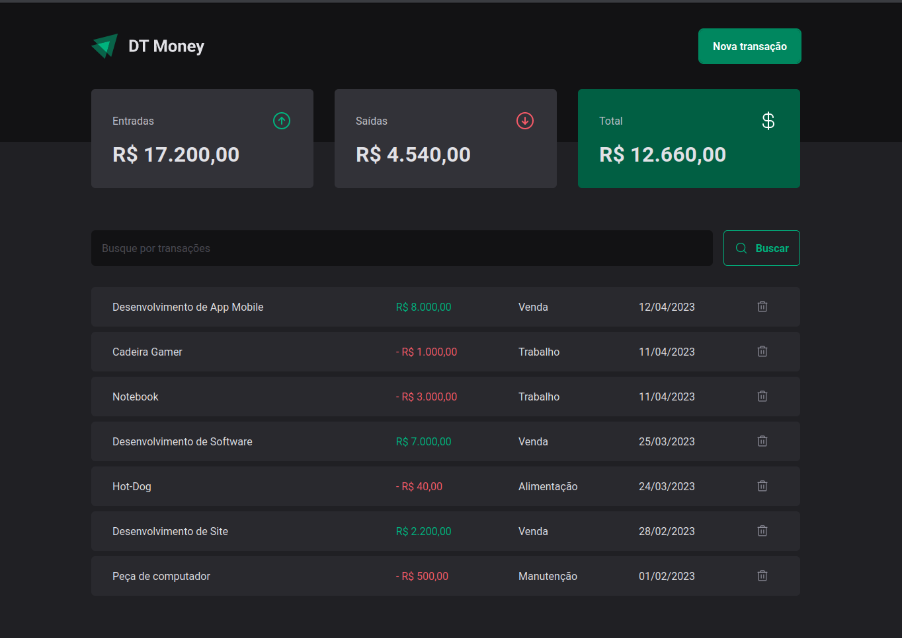

<h1 align="center">
  dt-money
</h1>

  

 

##  Projeto

Pojeto 03 do Bootcamp Ignite da Rocketseat.

## ✨ Tecnologias

Esse projeto foi desenvolvido com as seguintes tecnologias:

- [ReactJS](https://reactjs.org/)
- [TypeScript](https://www.typescriptlang.org/)
- [Styled-Components](https://styled-components.com/)
- [Radix UI](https://www.radix-ui.com/)
- [Zod](https://zod.dev/)
- [json-server](https://github.com/typicode/json-server)

## Conceitos

 - Manipulação de rotas, com React Router DOM
 - Validação de formulários com Zod
 - Utilização de componentes primitivos com o Radix UI
 - Context API, para implementação do contexto de transações
 - Criação de hook para cálculos do resumo (Summary)
 - Utilização do json-server para simular o back-end da aplicação.

## Utilização do projeto

### 💾 Baixar o projeto
Faça o clone do repositório para ter uma versão do projeto em sua máquina: 
`$ git clone https://github.com/ViniciusPrataKloh/dt-money.git`

### 🧰 Instalar dependências
`$ npm install`  

### 🚀 Iniciar a API json-server
`$ npm run dev:server`

### 🚀 Iniciar o projeto front-end
`$ npm run dev`
 